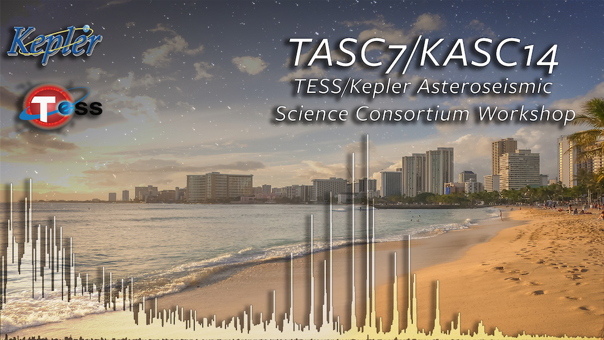

<!-- 

  <h4 class="alert-heading">Registration is now open!</h4>
  
We are pleased to announce that registration for TASC7 is now active. Please carefully read the information on the registration page for instructions on abstract submission, payment, and accomodation.

 -->

----

*Over the past decades, asteroseismology has been established as one of the most powerful tools to study stars and exoplanets in our galaxy. With TESS well into its second extended mission, this workshop will celebrate the ongoing successes from the exploration of Kepler/K2 and TESS data, and discuss future challenges and opportunities. Expected topics broadly include asteroseismology/stellar astrophysics, exoplanet science and galactic astronomy.*

The workshop will take place from 17-21 July 2023 at the University of Hawaiʻi at Mānoa campus in Honolulu, Hawaiʻi. Participation will be possible online and in-person.

 <!-- &nbsp; -->

  <h4 class="alert-heading">Key dates</h4>

  

  
May 1 2023: Deadline for student registration waiver applications & on-campus housing requests

  
 May 15 2023: Deadline for contributed talk abstracts & Early registration payment closes 

  
June 15 2023: Deadline for poster abstracts & Standard registration payment closes

  
July 3 2023: Late registration payment & online-only registration closes

July 17-21 2023: TASC7/KASC14 workshop

  

#### Contact

To contact the LOC, please email tasc7@hawaii.edu
