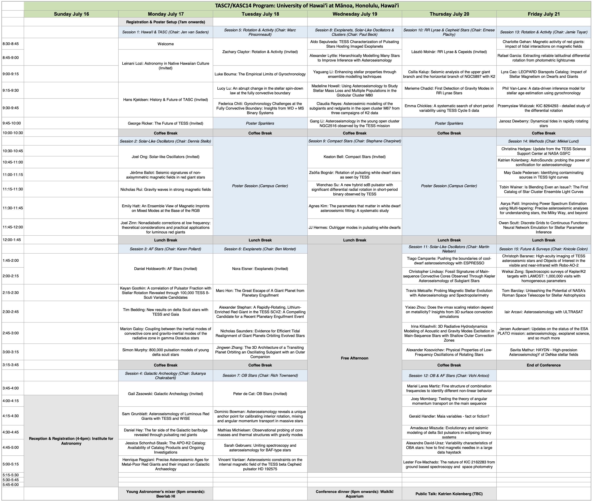

- [Invited speakers](#invited-speakers)
- [Registered participants](#registered-participants)
- [Program](#program)

----

## Invited speakers

Confirmed invited speakers include:

- Keaton Bell (Queens College CUNY)
- Peter de Cat (Royal Observatory Belgium)
- Zachary Claytor (University of Florida)
- Nora Eisner (CCA/Flatiron Institute)
- Daniel Holdsworth (University of Central Lancashire)
- Hans Kjeldsen (Aarhus University)
- Leinani Lozi (TMT & ʻOhana Kilo Hōkū)
- László Molnár (Konkoly Observatory)
- George Ricker (MIT)
- Joel Ong (University of Hawaiʻi)
- Gail Zasowski (University of Utah)

## Registered participants

The full list of registered (online and in-person) participants [can be found here](https://tasc.ifa.hawaii.edu/participants/).

## Program

A PDF version of the program can be downloaded by clicking on the image below.

Contributed talk abstracts that were not selected will be converted to posters (for those who have selected that option on the registration form). A full program including posters and abstracts will be made available after poster abstract deadline (June 22).

<!-- The main categories (or tracks) of the different talks as well as their coloring can be adapted in the `_config.yml` file under `conference.talks.main_categories`. See also the [Talk Settings](https://github.com/DigitaleGesellschaft/jekyll-theme-conference/#talk-settings-main-categories) section of the theme's README file. -->
